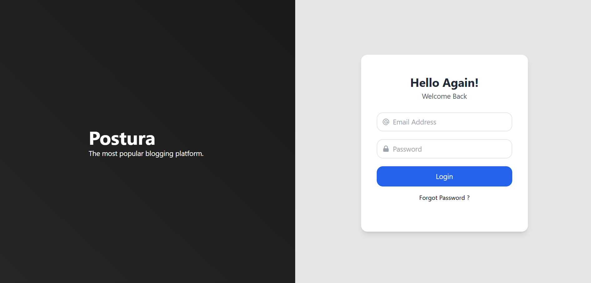
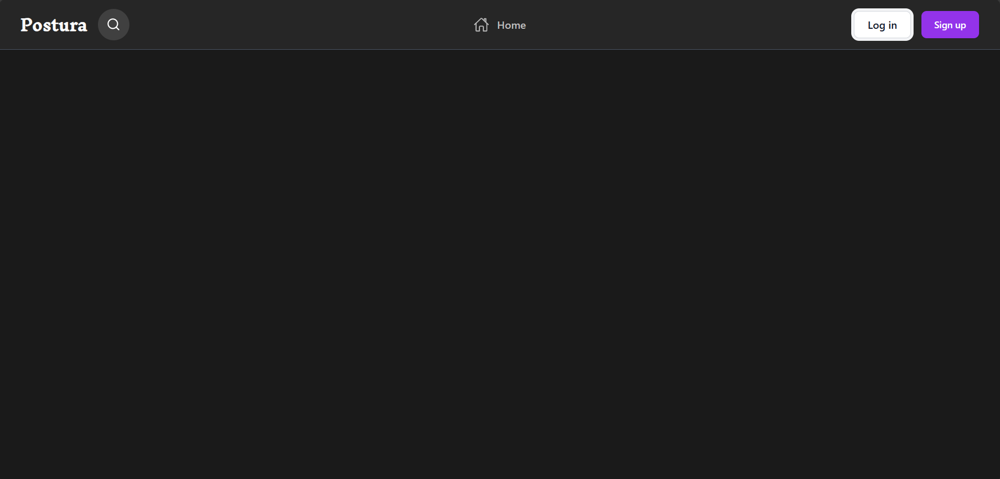
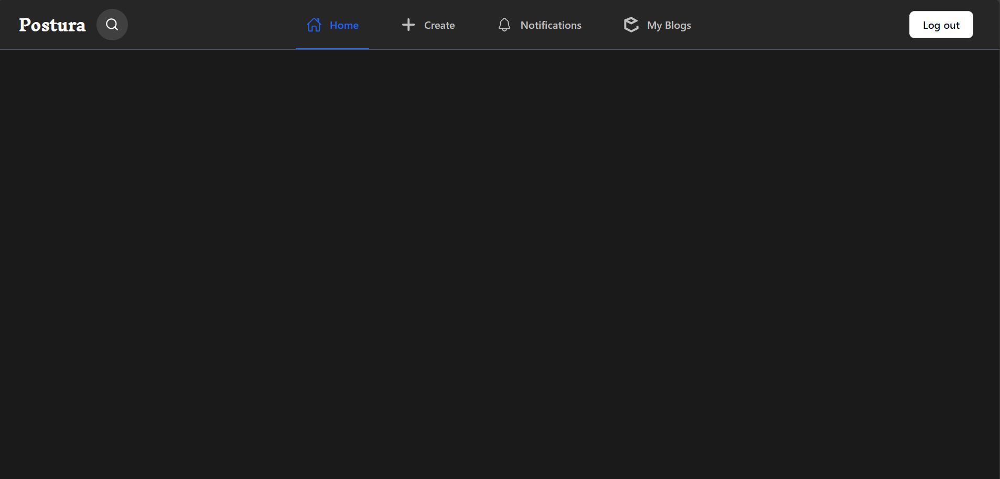

# Postura

## Description

This project is a blog platform built using React, Redux, and Express.js. It serves as a foundation for building a fully-featured blog where users can interact with content, manage their profiles, and more. The platform's architecture is designed for scalability and ease of extension, allowing for the addition of various features such as content creation, user management, and enhanced user experiences in the future.

The backend is built with Express.js to handle server-side logic, while the frontend is developed with React and Redux to manage state and create dynamic user interfaces.

## Features

- 🖥️ **Navbar**: A responsive navigation bar that adapts to different screen sizes.
- 🔑 **Login Page**: Users can log in to the application using the login form.
- 🔐 **Authentication**: Authentication flow is implemented to verify users and allow access based on credentials.

## Technologies Used

- ⚛️ **React**: For building the front end.
- 🔄 **Redux**: For state management.
- 🌐 **Axios**: For making API requests.
- 🖋️ **CSS**: For styling the application.
- 🗄️ **Express.js**: For handling backend routes.

## Installation

1. Clone this repository:

   ```bash
   git clone https://github.com/jiniyasshah/Postura-Blog-Frontend.git
   ```

2. Install dependencies:

- **Frontend**:

  ```
  cd Postura-Blog-Frontend
  npm install
  ```

- **Backend**:
  The backend for this project is hosted in a separate repository. To set up the backend, follow the instructions in the official repository:

  [Backend Repository - Blog Platform API](https://github.com/jiniyasshah/blog-platform-api)

  Clone the backend repository and follow the setup instructions there.

  ```
  git clone https://github.com/jiniyasshah/blog-platform-api.git
  cd blog-platform-api
  npm install
  ```

## Usage

1. Start the backend server:
2. Start the frontend development server:
3. Visit `http://localhost:5173` in your browser to access the application.

## Screenshots

### Navbar

Here is a screenshot of the login page:


### Unauthenticated Home Page

Here is a screenshot of the unauthenticated home page:


### Authenticated Home Page

Here is a screenshot of the authenticated home page:


## License

This project is licensed under the MIT License - see the [LICENSE](LICENSE) file for details.

## Contributing

1. Fork the repository.
2. Create a new branch (`git checkout -b feature-branch`).
3. Make your changes and commit them (`git commit -am 'Add feature'`).
4. Push to the branch (`git push origin feature-branch`).
5. Create a new pull request.

We welcome all contributions! Please make sure your code adheres to the existing coding style, and include tests for new functionality where applicable.
